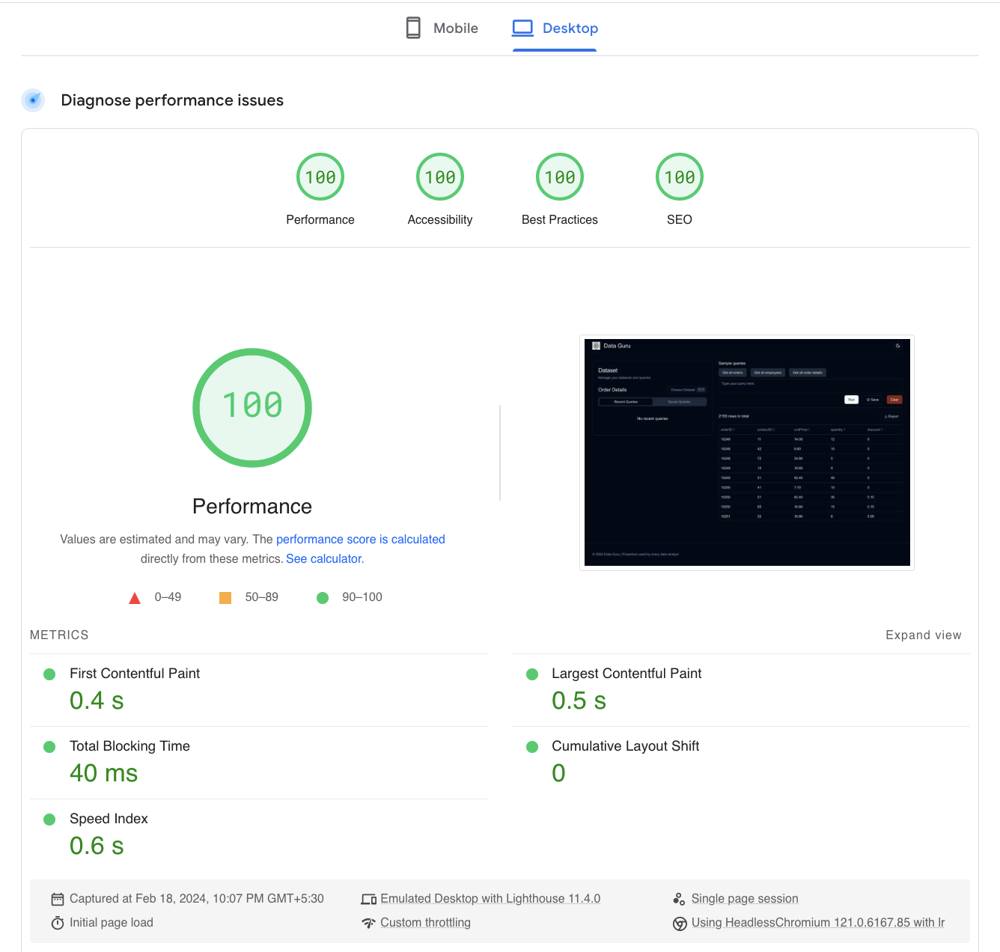

# DataGuru

DataGuru is a data analysis platform used by data analysts.

## Walkthrough video

## Features

- SQL editor with predefined queries to increase productivity.
- Select datasets and view recent and saved queries for each dataset.
- Virtualized table for smooth scrolling and improved performance.
- Sort table columns for better data organization.
- State of the application, including selected dataset, recent, and saved queries, is saved in local storage and restored when the page refreshes.
- Switch between light and dark mode for user comfort.
- Clean UI for enhanced user experience.

## Tech Stack

- React
- Vite: Next Generation Frontend Tooling
- Tailwind CSS: A utility-first CSS framework
- shadcn: Beautifully designed components using radix-ui
- Papa Parse: A powerful, in-browser CSV parser
- TanStack Libraries: Utilities for state management and tables

## Page Load Time

The average page load time is around 0.5 seconds.  
[PageSpeed Insights Report](https://pagespeed.web.dev/analysis/https-www-tusharmoraye-com-DataGuru/xwypygiw45?form_factor=desktop)

- First Contentful Paint: 0.4 s
- Largest Contentful Paint: 0.5 s
- Total Blocking Time: 40 ms
- Cumulative Layout Shift: 0
- Speed Index: 0.6 s

## Optimizations

- Implemented @tanstack/react-virtual to virtualize table rows, rendering only visible rows for performance optimization.
- Utilized React.memo to memoize the data table component, rendering only when data changes.
- Utilized React Query to optimize data fetching and caching.
- Employed Tailwind CSS to include only necessary CSS for reduced file size and improved load times.
